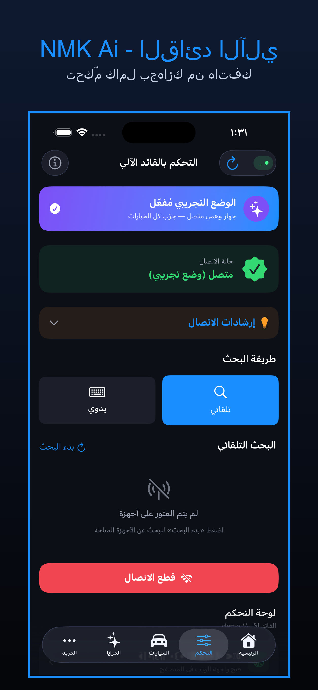
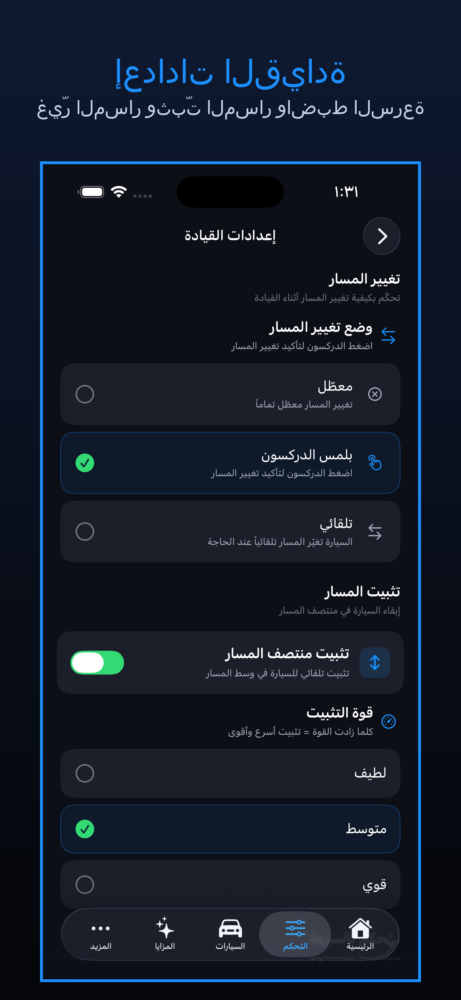
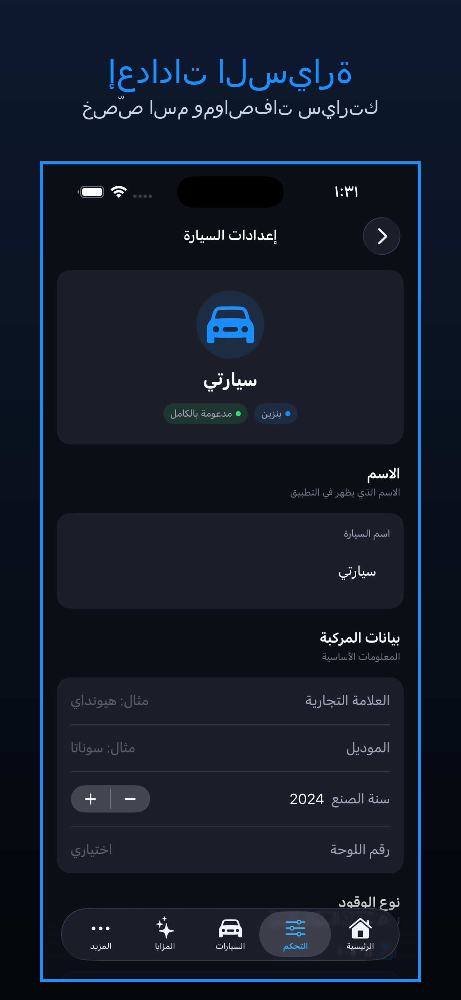

<div align="center">

# 🚗 NMK Ai — القائد الآلي

### تطبيق التحكم بنظام القيادة الذكية للأيفون

[](https://www.apple.com/ios/)
[](https://swift.org)
[](https://developer.apple.com/xcode/swiftui/)
[](./LICENSE)
[](./AppStore/AppStore_Metadata.md)

تطبيق أصلي بـ **SwiftUI** للأيفون، يجمع بين التحكم الكامل بجهاز القائد الآلي، وإعدادات قيادة قابلة للتخصيص، ودعم 291 سيارة — كل ذلك بواجهة عربية كاملة.

[الموقع](https://www.nmk.sa) •
[التواصل](https://wa.me/966550057797) •
[سياسة الخصوصية](./AppStore/PrivacyPolicy.md)

</div>

---

## ✨ المزايا الرئيسية

### 🔗 اتصال ذكي بالجهاز
- **بحث تلقائي** عن جهازك على شبكة Wi-Fi المحلية (منفذ 8082)
- **بحث يدوي** عبر إدخال عنوان IP
- اتصال **مباشر وآمن** دون أية وسطاء

### ⚙️ 5 شاشات إعدادات قابلة للتخصيص
| الإعداد | الوصف |
|---|---|
| 🚗 **القيادة** | تغيير المسار (تلقائي/بلمس الدركسون/معطّل)، تثبيت المسار، السرعة، المسافة، الأوضاع |
| 🚙 **السيارة** | الاسم، الموديل، الوقود، ناقل الحركة، اللوحة |
| 🗺️ **الخريطة** | تثبيت، نوع، تدوير، معلومات، الوضع الليلي |
| 👁️ **العرض المباشر** | جودة البث، الإطارات، التسجيل |
| 🔔 **التنبيهات** | الصوت، المسار، السرعة، التصادم، مراقبة السائق |

### 🎛️ 20+ إعداد حقيقي للقائد الآلي
تُرسل مباشرة لجهازك عبر API:
- الإعدادات الرئيسية (تفعيل النظام، مغادرة المسار، النظام المتري)
- التحكم الطولي (التسارع/الفرامل، تعطيل الرادار)
- التحكم الجانبي (التوجيه، الوضع بدون خطوط)
- الميزات التجريبية (الملاحة، MADS)
- الواجهة (كاميرا السائق، حد السرعة)
- السلامة (الاصطدام الأمامي، الإلغاء بالفرامل)

### 🚗 قاعدة بيانات 291 سيارة
- من **26 شركة مصنّعة** (تويوتا، هيونداي، كيا، فورد...)
- عرض تفصيلي لمستوى الدعم لكل موديل
- شعارات الشركات مرفقة

### 🔧 أدوات الجهاز
- كاميرا السائق المباشرة
- إعادة ضبط المعايرة
- دليل التدريب
- إعادة التشغيل / الإيقاف الآمن

---

## 📱 لقطات الشاشة

<div align="center">

| تبويب التحكم | إعدادات القيادة | إعدادات السيارة |
|:---:|:---:|:---:|
|  |  |  |

</div>

---

## 🏗️ المعمارية

```
NMKAi-Merged/
├── App/                         ← نقطة الدخول
├── Theme/                       ← نظام التصميم (NMKTheme)
├── Models/                      ← نماذج البيانات
│   ├── AppSettings.swift        ← الحاوية الكاملة
│   ├── DrivingSettings.swift    ← إعدادات القيادة
│   ├── CarProfile.swift         ← ملف السيارة
│   ├── MapSettings.swift        ← إعدادات الخريطة
│   ├── LiveViewSettings.swift   ← العرض المباشر
│   ├── AlertSettings.swift      ← التنبيهات
│   └── OpenpilotToggle.swift    ← إعدادات القائد الآلي
├── ViewModels/
│   └── SettingsStore.swift      ← التخزين المركزي (@Observable)
├── Services/
│   └── DeviceConnectionService.swift  ← طبقة الاتصال بالجهاز
├── Views/
│   ├── Components/              ← مكوّنات قابلة لإعادة الاستخدام
│   ├── Screens/                 ← الشاشات الرئيسية + التحكم
│   ├── Settings/                ← شاشات الإعدادات الخمس
│   └── Info/                    ← السيارات/المزايا/التركيب/التعليمات
├── Resources/
│   ├── Info.plist               ← إعدادات التطبيق
│   └── Assets.xcassets          ← الأيقونات + شعارات السيارات
├── AppStore/                    ← بيانات النشر على App Store
│   ├── AppStore_Metadata.md     ← كل نصوص المتجر
│   ├── PrivacyPolicy.md         ← سياسة الخصوصية
│   ├── PrivacyPolicy.html       ← نسخة جاهزة للاستضافة
│   └── Submission_Checklist.md  ← قائمة فحص النشر
└── docs/
    └── screenshots/             ← لقطات App Store
```

---

## 🛠️ التقنيات المستخدمة

| التقنية | الاستخدام |
|---|---|
| **SwiftUI** (iOS 17+) | واجهة المستخدم |
| **@Observable** (Swift 5.9+) | إدارة الحالة |
| **NavigationStack** | التنقّل الحديث (بدل NavigationView المهمل) |
| **#Preview** | معاينة الواجهات |
| **async/await** | عمليات الشبكة |
| **Network.framework** | اكتشاف الأجهزة |
| **URLSession** | الاتصال بـ REST API |
| **WebKit** | عرض واجهة الجهاز |
| **AVKit** | تشغيل الفيديو |

---

## 🚀 التشغيل للتطوير

### المتطلبات
- macOS 14.0+
- Xcode 15.0+
- iOS 17.0+

### الخطوات
```bash
# 1. استنساخ المستودع
git clone https://github.com/NMK-Ai/NMKAi.git
cd NMKAi

# 2. فتح المشروع
open NMKAi.xcodeproj

# 3. في Xcode: اختر Team في Signing & Capabilities
# 4. اختر محاكي iPhone 17 Pro
# 5. Cmd+R للتشغيل
```

### تجربة الوضع التجريبي
لرؤية كل الخيارات دون اتصال حقيقي بالجهاز:
```bash
xcrun simctl launch booted sa.nmk.NMKAi --tab 1 --demo
xcrun simctl launch booted sa.nmk.NMKAi --tab 1 --demo --screen driving
```

---

## 🔒 الخصوصية

التطبيق **لا يجمع أي بيانات**. كل شيء محفوظ محلياً على جهازك. اقرأ [سياسة الخصوصية الكاملة](./AppStore/PrivacyPolicy.md).

---

## 📦 النشر على App Store

راجع [قائمة فحص النشر](./AppStore/Submission_Checklist.md) للحصول على دليل خطوة بخطوة.

البيانات الجاهزة (وصف، كلمات مفتاحية، لقطات) موجودة في [AppStore_Metadata.md](./AppStore/AppStore_Metadata.md).

---

## 📞 التواصل

| الوسيلة | التفاصيل |
|---|---|
| 🌐 الموقع | [www.nmk.sa](https://www.nmk.sa) |
| 📧 البريد | support@nmk.sa |
| 💬 WhatsApp | +966 55 005 7797 |

---

## 📄 الترخيص

هذا المشروع **محتكر (Proprietary)** — جميع الحقوق محفوظة لـ NMK © 2026. انظر [LICENSE](./LICENSE).

<div align="center">

**صُنع بـ ❤️ في المملكة العربية السعودية**

</div>
